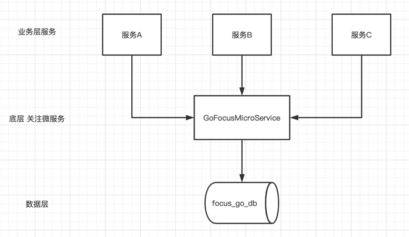

# 数据库名称:
focus_go_db

# 表结构:
```mysql
CREATE TABLE `t_focus` (
  `id` int(11) NOT NULL AUTO_INCREMENT COMMENT '主键ID',
  `uid` int(11) NOT NULL COMMENT '用户ID',
  `service_name` varchar(255) NOT NULL COMMENT '微服务项目名称(最好写对应项目名称)',
  `focused_type` varchar(255) NOT NULL COMMENT '被关注数据类型(最好写英文含义)',
  `focused_data` varchar(255) NOT NULL COMMENT '被关注的数据',
  `state` smallint(1) DEFAULT '1' COMMENT '状态',
  `create_time` datetime DEFAULT CURRENT_TIMESTAMP COMMENT '创建时间',
  `update_time` datetime DEFAULT CURRENT_TIMESTAMP ON UPDATE CURRENT_TIMESTAMP COMMENT '更新时间',
  PRIMARY KEY (`id`),
  UNIQUE KEY `unique_key` (`uid`,`service_name`,`focused_type`,`focused_data`) USING BTREE
) ENGINE=InnoDB AUTO_INCREMENT=1 DEFAULT CHARSET=utf8mb4;
```

业务层系统对接架构图:


对接方式:不同服务携带对应的服务ID 通过接口进行调用;

实现功能点:
1.不同服务 可以调用此微服务
2.关注功能 不限制任务内容;比如 用户ID/商品ID 等等任何类型的字符串数据
